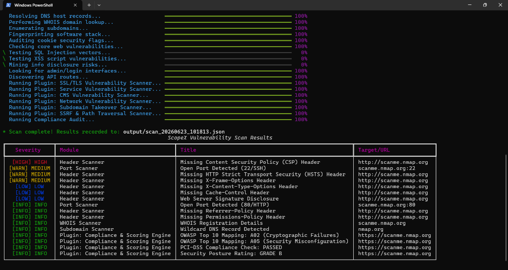
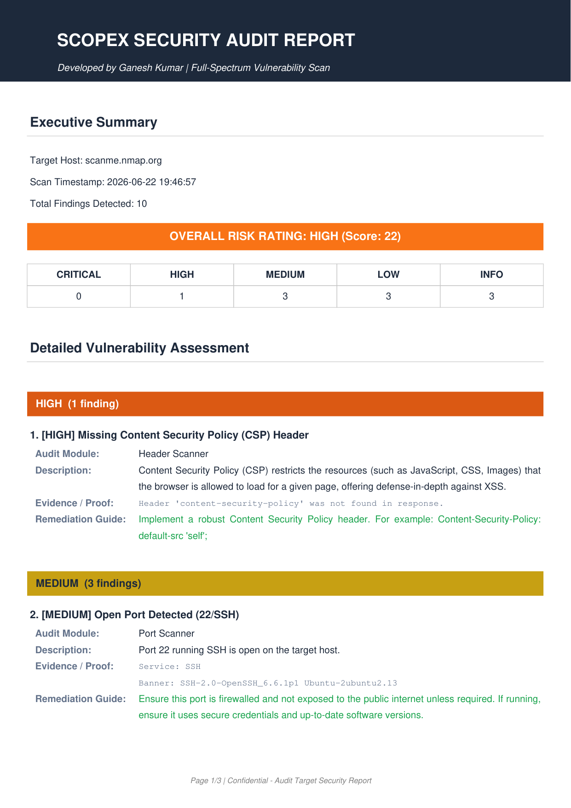

# ScopeX — Python-Native VAPT Toolkit


[](https://www.python.org/)
[](LICENSE)
[](CHANGELOG.md)
[](#)
[](DISCLAIMER.md)

ScopeX is an advanced, terminal-based security auditing and vulnerability scanning toolkit built entirely in pure Python. It conducts high-accuracy, full-spectrum security assessments including port scanning, SQLi, XSS, SSRF, JWT auditing, and CVE mapping, and generates compliance scores and professional PDF reports without relying on heavy external binaries like Nmap or OpenSSL.

> [!CAUTION]
> **LEGAL NOTICE**: Usage of ScopeX for scanning targets without prior written authorization is strictly prohibited. Before operating, read the complete terms in [DISCLAIMER.md](DISCLAIMER.md).

Developed by **Ganesh Kumar**.

---

## 🔍 Features

*   **14 Core Scanning Modules**: Built-in scanners for ports, headers, SSL/TLS, DNS, subdomains, WAF, cookies, API endpoints, WHOIS, and web vulnerabilities.
*   **7 Advanced Nessus-Style Plugins**: Dynamic plugins check protocol vulnerabilities (e.g. Heartbleed CVE-2014-0160, Mysql empty pass, SMTP open relay) and server configurations.
*   **Compliance & Risk Scoring Engine**: Maps findings to OWASP Top 10 and PCI-DSS requirements, calculating a letter-grade (A–F) health rating.
*   **Professional PDF Reports**: Auto-compiles clean, executive-ready reports with color-coded severity panels, CVSS scores, and remediation steps.
*   **Pure Python implementation**: Minimal dependencies (`requests`, `rich`, `click`, `fpdf2`, `beautifulsoup4`) running entirely in user-space.

---

## 💻 Terminal Scan Output

Below is the real-time terminal audit view when scanning a target:



---

## 🚀 Quick Start

### Installation

1. Clone the repository:
   ```bash
   git clone https://github.com/ganeshkumar-2005/scopex.git
   cd scopex
   ```

2. Set up virtual environment and install dependencies:

   **On Windows:**
   ```cmd
   python -m venv venv
   venv\Scripts\activate
   pip install -r requirements.txt
   ```

   **On macOS/Linux:**
   ```bash
   python -m venv venv
   source venv/bin/activate
   pip install -r requirements.txt
   ```

### Basic Scan Command
```bash
python scopex.py scan --target example.com
```

---

## ⚙️ Scan Profiles & Usage

ScopeX matches target scope via predefined profiles:

| Profile | Command Flag | Included Modules | Timeout |
| :--- | :--- | :--- | :--- |
| **Quick** | Default (none) / Config | 20 common ports, HTTP headers, DNS validation | 2.0s |
| **Standard** | `--target <host>` | SSL/TLS, web vulns, headers, ports, cookies, WAF | 3.0s |
| **Full** | `--all` | Complete port sweep, all basic scanners, and deep plugins | 5.0s |

### Run Command Examples

*   **Full Spectrum Scan** (Basic + Deep Scanners + All Plugins):
    ```bash
    python scopex.py scan --target example.com --all
    ```
*   **Deep Web Vulnerabilities Scan Only** (SQLi, XSS, WAF, API):
    ```bash
    python scopex.py scan --target example.com --deep
    ```
*   **Automated Scan (Non-Interactive)**:
    ```bash
    python scopex.py scan --target example.com --all --force
    ```
*   **Generate PDF Report**:
    ```bash
    python scopex.py report --input output/scan_20260623_080000.json
    ```

---

## 📄 Professional PDF Report Sample

Below is a preview of the generated executive security report, sorted by severity and listing compliance criteria:



---

## 🛠️ Core Auditing Modules (14 Scanners)

<details>
<summary><b>1. Port Scanner (<code>scanners/port_scanner.py</code>)</b></summary>
<br>

*   **Methodology**: Concurrent raw TCP socket connection attempts.
*   **Capabilities**: Captures protocol banners, utilizing target hostname in HTTP headers to trigger realistic web server responses instead of generic errors.
*   **Default Ports**: Scans 50+ common admin, database, and message queue ports.
</details>

<details>
<summary><b>2. HTTP Header Scanner (<code>scanners/header_scanner.py</code>)</b></summary>
<br>

*   **Analyzed Headers**: Audits `Strict-Transport-Security`, `Content-Security-Policy` (CSP), `X-Content-Type-Options`, `X-Frame-Options`, `Referrer-Policy`, and `Permissions-Policy`.
*   **Deep CSP Audit**: Parses directives to flag dangerous directives (like `unsafe-inline`, `unsafe-eval`, `data:` URIs, or wildcard scopes) and identifies missing clickjacking protection.
*   **Server Disclosures**: Detects backend version leakages in headers such as `Server`, `X-Powered-By`, and `X-AspNet-Version`.
</details>

<details>
<summary><b>3. SSL Scanner (<code>scanners/ssl_scanner.py</code>)</b></summary>
<br>

*   **Certificate Validity**: Validates expiration dates, issuer hierarchies, and hostname matching.
*   **Cipher Suite Auditing**: Enumerates supported cipher suites, warning about obsolete protocols (TLS 1.0, TLS 1.1) and broken/weak ciphers (RC4, 3DES, NULL, EXPORT).
</details>

<details>
<summary><b>4. DNS Scanner (<code>scanners/dns_scanner.py</code>)</b></summary>
<br>

*   **DNS Records**: Resolves standard records (A, AAAA, MX, TXT, NS, CNAME).
*   **Leak Detection**: Flags if public records point to RFC 1918 private IP addresses (IP leakage).
</details>

<details>
<summary><b>5. Subdomain Scanner (<code>scanners/subdomain_scanner.py</code>)</b></summary>
<br>

*   **Enumeration**: Performs dictionary-based subdomain brute-forcing.
*   **Wildcard Protection**: Resolves a random, non-existent subdomain beforehand; if it resolves, the target domain uses a wildcard DNS record, and the scanner pauses to prevent high false-positive rates.
</details>

<details>
<summary><b>6. Vulnerability Scanner (<code>scanners/vuln_scanner.py</code>)</b></summary>
<br>

*   **CORS Audit**: Probes with multiple origin variations (e.g. `null`, subdomains, suffix bypasses like `target.com.attacker.com`, and protocol downgrades).
*   **Clickjacking**: Checks framing options on the target endpoint.
*   **Open Redirect**: Probes 15+ common redirection parameters (`redirect_url`, `return_to`, `next`, `dest`, etc.) with external payload links.
*   **Sensitive Files**: Probes for backup/configuration files (`.git`, `.env`, `wp-config.php`, `.htaccess`). It fingerprints the server's custom 404 response layout to ignore false HTTP 200/OK status codes and validates response content signatures (e.g., expecting `RewriteEngine` inside `.htaccess`).
*   **RFC 9116 security.txt**: Validates presence and compliance of `security.txt` files, checking for required Contact and Expires directives.
</details>

<details>
<summary><b>7. SQL Injection Scanner (<code>scanners/sqli_scanner.py</code>)</b></summary>
<br>

*   **Error-Based**: Injects characters (`'`, `"`, `\`) and monitors response content for database system error templates (MySQL, MSSQL, Oracle, PGSQL).
*   **Time-Blind Verification**: Injects delay payloads (`pg_sleep`, `sleep`). When a delay is observed, it confirms the vulnerability by sending a secondary verification payload with a different delay interval, ruling out random network jitter.
</details>

<details>
<summary><b>8. XSS Scanner (<code>scanners/xss_scanner.py</code>)</b></summary>
<br>

*   **Reflected XSS**: Injects script payloads and parses the response to ensure they reflect unescaped. If the payload is reflected but HTML-encoded (e.g. `&lt;script&gt;`), it reports the reflection as secure.
*   **DOM-Based XSS**: Parses target scripts for client-side sources (`location.hash`, `document.URL`) referencing dangerous sinks (`eval`, `document.write`, `innerHTML`).
</details>

<details>
<summary><b>9. Technology Fingerprinter (<code>scanners/tech_fingerprinter.py</code>)</b></summary>
<br>

*   **Fingerprinting**: Identifies software stacks based on headers, cookies, and DOM components.
*   **CVE Mapping**: Cross-references detected technologies with a localized vulnerability dictionary.
</details>

<details>
<summary><b>10. Cookie Scanner (<code>scanners/cookie_scanner.py</code>)</b></summary>
<br>

*   **Audit**: Analyzes cookies for `HttpOnly`, `Secure`, and `SameSite` configurations.
*   **JWT Cryptography Audit**: Detects JWT cookies, checking for the `none` algorithm and brute-forcing symmetric signatures (HS256/HS384/HS512) against common weak secrets.
</details>

<details>
<summary><b>11. WAF Detector (<code>scanners/waf_detector.py</code>)</b></summary>
<br>

*   **Signatures**: Identifies web application firewalls (Cloudflare, AWS WAF, ModSecurity, Akamai, etc.) based on headers and blocked requests.
</details>

<details>
<summary><b>12. Information Disclosure (<code>scanners/info_disclosure.py</code>)</b></summary>
<br>

*   **Scraper**: Reviews comments and script files using BeautifulSoup.
*   **Regex Extraction**: Flags private IPs, AWS credentials, SSH private keys (PEM), emails, and Slack Webhooks.
</details>

<details>
<summary><b>13. Administration Scanner (<code>scanners/auth_scanner.py</code>)</b></summary>
<br>

*   **Exposures**: Probes common admin panels and login portals.
</details>

<details>
<summary><b>14. API Scanner (<code>scanners/api_scanner.py</code>)</b></summary>
<br>

*   **Routes**: Searches for REST API version points.
*   **GraphQL**: Submits introspection query payloads to `/graphql` using appropriate `application/json` structures to check for exposed database schemas.
</details>

---

## 🔌 Advanced Vulnerability Plugins

<details>
<summary><b>1. SSL Attacks (<code>plugins/ssl_vulns.py</code>)</b></summary>
<br>

*   **Heartbleed (CVE-2014-0160)**: Fully implemented TLS record-level heartbeat request test.
*   **POODLE (CVE-2014-3566)**: Checks for SSLv3 support.
*   **DROWN (CVE-2016-0800)**: Checks for SSLv2 support.
*   **FREAK (CVE-2015-0204)**: Verifies if weak export-grade 512-bit keys are accepted.
*   **CRIME (CVE-2012-4929)**: Identifies active TLS-level compression.
</details>

<details>
<summary><b>2. Service Protocol Audits (<code>plugins/service_vulns.py</code>)</b></summary>
<br>

*   **FTP Anonymous (CVE-1999-0497)**: Checks if the target FTP server allows passwordless anonymous access.
*   **SSH Protocol & CVE Checker**: Resolves the SSH service banner, checks for legacy SSHv1 support, and compares the SSH version against historical CVE databases.
*   **SMTP Open Relay**: Verifies if mail transfer agents accept relay mail for unauthorized external recipients.
*   **DB Passwordless Exposures**: Decodes MySQL protocol handshake greeting packets on port 3306 and attempts passwordless root login. Performs a similar authentication check against Redis.
</details>

<details>
<summary><b>3. CMS Scanner (<code>plugins/cms_scanner.py</code>)</b></summary>
<br>

*   **WordPress**: Runs REST API author enumeration (`?author=1..10`), WordPress plugin version discovery via readme.txt parsing, XML-RPC DDoS amplification checks, and WordPress core version audits.
*   **Joomla & Drupal**: Checks core configurations and audits for outdated Drupal cores vulnerable to Drupalgeddon 2 (CVE-2018-7600).
</details>

<details>
<summary><b>4. Network Security (<code>plugins/network_vulns.py</code>)</b></summary>
<br>

*   **DNS AXFR**: Resolves target nameservers (NS records) via DNS queries and performs zone transfer attempts directly against the authoritative nameservers.
*   **SNMP**: Checks for public/private SNMP community strings.
*   **SMB Signing**: Inspects SMB protocol responses on port 445 to determine if message signing is required.
*   **LDAP**: Connects to port 389 and sends a raw LDAP BindRequest with empty credentials to verify anonymous bind permissions.
</details>

<details>
<summary><b>5. Subdomain Takeover (<code>plugins/subdomain_takeover.py</code>)</b></summary>
<br>

*   **Takeovers**: Assesses target CNAMES pointing to inactive third-party cloud hosting providers.
</details>

<details>
<summary><b>6. SSRF & Path Traversal (<code>plugins/ssrf_scanner.py</code>)</b></summary>
<br>

*   **Probes**: Audits query fields for Local File Inclusion (LFI) and Server-Side Request Forgery (SSRF) vulnerabilities using common directory paths and loopback URLs.
</details>

---

## 🏛️ Project Architecture

ScopeX runs concurrent checks asynchronously using Python thread pools, routing raw TCP bytes and HTTP packets direct to target servers:

```
ScopeX/
├── scopex.py              # CLI Controller (Rich + Click)
├── config.json              # Scan Profiles & Subdomain Lists
├── requirements.txt         # Core dependencies
├── scanners/                # 14 Protocol-level basic/deep scanners
│   ├── port_scanner.py      # TCP raw socket sweeps
│   ├── sqli_scanner.py      # Error & Time-blind blind injection
│   └── ...                  # Other scanners
├── plugins/                 # Vulnerability exploits & compliance mapping
│   ├── compliance.py        # OWASP/PCI mapping & grading
│   ├── ssl_vulns.py         # Raw TLS Heartbleed prober
│   └── ...                  # Other plugins
├── reports/                 # PDF builder
│   └── pdf_report.py        # FPDF2 engine
└── utils/                   # Shared connection helpers & output colors
```

---

## ⚠️ Known Limitations & Tradeoffs

To ensure a lightweight footprint, ScopeX uses pure Python implementations:

*   **No Heavy Network Drivers (Nmap/Masscan)**: The port scanner runs in user space using Python's `socket` library. It does not perform SYN scanning (half-open) and relies on full TCP handshakes (`connect_ex`). This makes it slower and more visible in firewall logs than native binary tools.
*   **No Native OpenSSL Wrapping**: Legitimate SSL testing tools (like `testssl.sh`) query remote endpoints by negotiating specific cipher suites using local OpenSSL binaries. ScopeX builds raw handshake payloads using Python's `ssl` module or custom socket bytes, which may not catch complex renegotiation bugs.
*   **Thread Pool Limits**: Multi-threading in Python is subject to the Global Interpreter Lock (GIL). For heavy networking, this is mostly fine (I/O bound), but dictionary brute-forcing of thousands of subdomains is less efficient than Go-based tools like `amass` or `subfinder`.
*   **WAF Interference**: Because ScopeX uses standard HTTP requests, active WAFs can block its IP address during SQLi or XSS scanning, resulting in false negatives.

---

## ⚖️ Legal & Disclaimer

**AUTHORIZED USE ONLY**: Usage of ScopeX for scanning targets without prior written authorization is strictly prohibited. The developer, **Ganesh Kumar**, assumes no liability for misuse, damage, or loss caused by this software.
