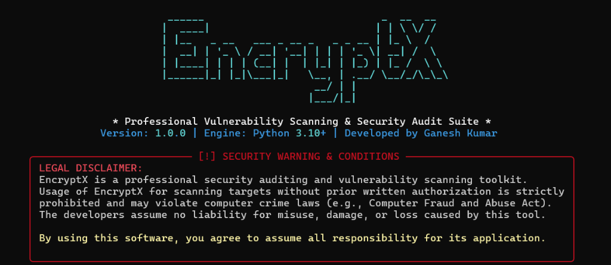

# EncryptX - Full-Spectrum Infrastructure Security Auditing Toolkit



EncryptX is an advanced, terminal-based security auditing and vulnerability scanning toolkit. Built entirely in Python with zero heavy system dependencies (such as Nmap, OpenSSL bin, or heavy network frameworks), it combines **14 basic and deep infrastructure scanners**, **7 advanced Nessus-style vulnerability plugins**, and a **custom scoring & compliance engine**. 

Developed by **Ganesh Kumar**.

---

## Table of Contents
- [Project Architecture](#project-architecture)
- [Core Auditing Modules (14 Scanners)](#core-auditing-modules-14-scanners)
- [Advanced Nessus-Style Plugins (Vulnerability Checks)](#advanced-nessus-style-plugins-vulnerability-checks)
- [Compliance & Risk Scoring Engine](#compliance--risk-scoring-engine)
- [PDF Report Generation](#pdf-report-generation)
- [Configuration Details](#configuration-details)
- [Installation & Setup](#installation--setup)
- [Usage Guide & Commands](#usage-guide--commands)
- [Legal & Disclaimer](#legal--disclaimer)

---

## Project Architecture

EncryptX is structured modularly to run checks concurrently via thread pools.

```
EncryptX/
├── encryptx.py              # CLI Controller (built on Click & Rich)
├── config.json              # Configurations (profiles, timeouts, subdomain wordlists)
├── requirements.txt         # Package dependencies
├── .gitignore               # Excludes reports, local caches, and environments
├── scanners/                # Module implementations for the 14 basic/deep scans
│   ├── __init__.py          # Exports all scanners
│   ├── port_scanner.py      # TCP port scanner & banner grabber
│   ├── header_scanner.py    # HTTP security headers auditor
│   ├── ssl_scanner.py       # SSL certificate check & TLS ciphers
│   ├── dns_scanner.py       # DNS zone analysis & IP leaks
│   ├── subdomain_scanner.py # Subdomain brute-forcer
│   ├── vuln_scanner.py      # CORS, Clickjacking, Open Redirect, Sensitive files
│   ├── sqli_scanner.py      # Active SQL Injection tester
│   ├── xss_scanner.py       # Active Cross-Site Scripting tester
│   ├── tech_fingerprinter.py# Technology stack parser & CVE lookup
│   ├── cookie_scanner.py    # Cookie attributes & JWT parser
│   ├── waf_detector.py      # Passive/Active WAF & CDN detector
│   ├── info_disclosure.py   # Information leaks (IPs, keys, credentials)
│   ├── auth_scanner.py      # Administration panel finder
│   └── api_scanner.py       # API routes & GraphQL introspector
├── plugins/                 # Nessus-style plugins checking CVEs and configurations
│   ├── __init__.py          # Plugin registry & dynamic loader
│   ├── base_plugin.py       # Abstract base class for standardized results
│   ├── ssl_vulns.py         # SSL attacks (Heartbleed, POODLE, BEAST, DROWN, etc.)
│   ├── service_vulns.py     # Protocol auth checks (FTP, SSH, SMTP, Redis, MySQL)
│   ├── cms_scanner.py       # CMS audits (WordPress, Joomla, Drupal)
│   ├── network_vulns.py     # Protocol security (DNS AXFR, SNMP, SMB, NTP)
│   ├── subdomain_takeover.py# Dangling CNAME & cloud takeover detection
│   ├── ssrf_scanner.py      # LFI, RFI, Path Traversal, Null Byte, SSRF parameters
│   └── compliance.py        # Compliance mapping (OWASP, PCI-DSS) & grading engine
├── reports/                 # Reporting system
│   ├── __init__.py
│   └── pdf_report.py        # FPDF2 layout builder with indented text blocks
└── utils/                   # Helpers package
    ├── __init__.py
    ├── banner.py            # Console ASCII Art banner & disclaimer
    └── helpers.py           # Network request wrappers & validation helpers
```

---

## Core Auditing Modules (14 Scanners)

### 1. Port Scanner (`scanners/port_scanner.py`)
- **Methodology**: Uses raw TCP socket connection attempts over configured ports.
- **Features**: Grab service banners upon connection, matching standard protocols (SSH, HTTP, FTP, etc.).

### 2. HTTP Header Scanner (`scanners/header_scanner.py`)
- **Analyzed Headers**: Audits for the presence and configuration values of `Strict-Transport-Security` (HSTS), `Content-Security-Policy` (CSP), `X-Content-Type-Options`, `X-Frame-Options`, `Referrer-Policy`, and `Permissions-Policy`.
- **Information Leakage**: Identifies detailed system versions leaked in `Server`, `X-Powered-By`, and `X-AspNet-Version` headers.

### 3. SSL Scanner (`scanners/ssl_scanner.py`)
- **Certificate Validity**: Evaluates expiration date, issuer details, signature algorithm, and host matching.
- **Protocol Analysis**: Assesses support for insecure legacy protocols (TLS 1.0, TLS 1.1) and lists cipher suites.

### 4. DNS Scanner (`scanners/dns_scanner.py`)
- **DNS Records**: Resolves standard records (A, AAAA, MX, TXT, NS, CNAME).
- **Leak Detection**: Flags if public DNS records resolve to RFC 1918 private IP addresses (IP leakage).

### 5. Subdomain Scanner (`scanners/subdomain_scanner.py`)
- **Enumeration**: Performs rapid dictionary-based brute-force subdomain resolution using the built-in wordlist.
- **Validation**: Verifies active subdomains by performing host lookup checks.

### 6. Vulnerability Scanner (`scanners/vuln_scanner.py`)
- **CORS Audit**: Sends requests with arbitrary `Origin` headers to identify permissive CORS policies (`Access-Control-Allow-Origin: *` or mirroring).
- **Clickjacking**: Validates the absence of framing controls (X-Frame-Options / CSP frame-ancestors).
- **Open Redirect**: Tests URL query parameters for open redirections.
- **Sensitive Files**: Probes for backup/configuration files (`.git`, `.env`, `config.php`, etc.).

### 7. SQL Injection Scanner (`scanners/sqli_scanner.py`)
- **Error-Based**: Injects payloads (`'`, `"`, `\`, `OR 1=1`) and checks response content for database system error signatures (MySQL, PostgreSQL, MSSQL, Oracle).
- **Time-Based Blind**: Injects sleep/benchmark queries (`pg_sleep`, `sleep`) and monitors latency variations to confirm injection vulnerability.

### 8. XSS Scanner (`scanners/xss_scanner.py`)
- **Reflected XSS**: Injects script payloads into URL query parameters and parses the response DOM to verify if the payload is reflected unescaped.
- **DOM-Based XSS**: Analyzes HTML content for dangerous sources (`location.hash`, `document.URL`) and sinks (`eval(`, `document.write(`, `innerHTML`) in inline scripts.

### 9. Technology Fingerprinter (`scanners/tech_fingerprinter.py`)
- **Signature Matching**: Matches response headers, HTML elements, and cookie structures against technology profiles.
- **CVE Database Lookup**: Compiles matching technology names and queries them against known vulnerability vectors.

### 10. Cookie Scanner (`scanners/cookie_scanner.py`)
- **Flags Check**: Audits all session cookies for `HttpOnly`, `Secure`, and `SameSite` flags.
- **JWT Analysis**: Decodes JWT headers and payloads, flagging weak key signatures or `none` algorithm acceptance.

### 11. WAF Detector (`scanners/waf_detector.py`)
- **CDN/WAF Fingerprints**: Inspects headers (`server`, `x-cdn`, `cf-ray`) for known protectors like Cloudflare, AWS WAF, Akamai, or ModSecurity.

### 12. Information Disclosure (`scanners/info_disclosure.py`)
- **Content Scraper**: Scrapes HTML comments, scripts, and texts.
- **Regex Extraction**: Identifies private IPs, AWS Access Keys, private keys (PEM), emails, and Slack Webhooks.

### 13. Administration Scanner (`scanners/auth_scanner.py`)
- **Exposures**: Probes common admin entry paths (`/admin`, `/wp-login.php`, `/cpanel`, etc.) to flag exposed management interfaces.

### 14. API Scanner (`scanners/api_scanner.py`)
- **API Discovery**: Probes for common API endpoints (`/api/v1/`, `/v2/`).
- **GraphQL Audit**: Attempts a GraphQL introspection query to check for schema exposures.

---

## Advanced Nessus-Style Plugins (Vulnerability Checks)

Advanced plugins are loaded dynamically. They perform deep vulnerability checks with CVSS scoring and CVE mapping:

### 1. SSL Attacks (`plugins/ssl_vulns.py`)
- **Heartbleed (CVE-2014-0160)**: Probes TLS heartbeat negotiation properties.
- **POODLE (CVE-2014-3566)**: Tests if SSLv3 protocol negotiation is accepted.
- **BEAST (CVE-2011-3389)**: Evaluates CBC ciphers support under TLS 1.0.
- **DROWN (CVE-2016-0800)**: Assesses SSLv2 protocol support.
- **FREAK (CVE-2015-0204)**: Checks if export-grade weak key systems are accepted.
- **CRIME (CVE-2012-4929)**: Validates if TLS-level compression is active.

### 2. Service Protocol Audits (`plugins/service_vulns.py`)
- **FTP Anon (CVE-1999-0497)**: Attempts passwordless anonymous login.
- **SSH Weak Algos**: Detects support for legacy protocols (SSHv1) and weak ciphers.
- **SMTP Open Relay**: Tests if mail relays are open for unauthorized addresses.
- **DB Exposures**: Probes database ports (MySQL, Redis) for passwordless access.
- **Default Logins**: Tests common credentials (`admin:admin`, `admin:password`, etc.) against exposed admin panels.

### 3. CMS Scanner (`plugins/cms_scanner.py`)
- **WordPress**: Detects versions, XML-RPC accessibility (DDoS vector), andREST API username enumeration.
- **Joomla**: Inspects directory details and checks for exposed backup files (`configuration.php.bak`).
- **Drupal**: Checks for outdated cores vulnerable to **Drupalgeddon 2 (CVE-2018-7600)** RCE.

### 4. Network Security (`plugins/network_vulns.py`)
- **DNS AXFR**: Attempts DNS zone transfers to fetch internal domain listings.
- **SNMP Community**: Validates default read community strings (`public`, `private`).
- **SMB Signing**: Audits if SMB message signing is required on port 445 (prevents NTLM relay).
- **NTP Monlist**: Queries NTP servers using the monlist command to check for DDoS amplification capability.

### 5. Subdomain Takeover (`plugins/subdomain_takeover.py`)
- **CNAME Analysis**: Inspects CNAME pointers for unresolved hosts.
- **Takeover Verification**: Matches response bodies to known signatures of inactive services (AWS S3, GitHub Pages, Heroku, Azure, Shopify) that are claimable.

### 6. SSRF & Path Traversal (`plugins/ssrf_scanner.py`)
- **Path Traversal**: Probes URL parameters with traversal sequences (`../../etc/passwd`, `..\..\..\windows\win.ini`) matching system signatures.
- **Null Byte Bypass**: Appends null bytes (`%00`) to test path termination filters.
- **SSRF**: Injects loopbacks (`127.0.0.1`, `localhost`) and cloud metadata endpoints (`169.254.169.254`) into URL parameters.
- **File Inclusion**: Audits LFI/RFI parameters.

---

## Compliance & Risk Scoring Engine

The **Compliance & Scoring Plugin (`plugins/compliance.py`)** runs at the end of the scan pipeline to analyze all findings:

1. **OWASP Top 10 2021 Mapping**: Maps findings to categories:
   - *A01: Broken Access Control* (CORS, Takeover, Auth bypass)
   - *A02: Cryptographic Failures* (SSL, HSTS, Ciphers)
   - *A03: Injection* (SQLi, XSS)
   - *A04: Insecure Design* (Rate limit, CSRF)
   - *A05: Security Misconfiguration* (Headers, Exposed DBs, Default Logins)
   - *A06: Vulnerable/Outdated Components* (Old CMS, CVE mappings)
   - *A07: Identification and Authentication Failures* (Credentials)
   - *A08: Software and Data Integrity Failures* (Missing CSP)
   - *A10: Server-Side Request Forgery* (SSRF)
2. **PCI-DSS Compliance Check**: Runs compliance audits against encryption and access rules (Requirement 2.3/4.1 on cryptography, Requirement 1.2.1/2.1 on default logins and database exposures).
3. **Host Security Posture Rating**: Assigns a final security letter grade (**A, B, C, D, or F**) based on CVSS scoring:
   - **Grade A**: Zero Critical/High/Medium vulnerabilities.
   - **Grade B**: Only minor Low/Medium vulnerabilities.
   - **Grade C**: Fair security with moderate issues.
   - **Grade D**: High/Critical issues present.
   - **Grade F**: Multiple Critical findings.

---

## PDF Report Generation

The PDF generator (`reports/pdf_report.py`) compiles the results into a professional audit document:
- **Branding**: Displays the project header: `Developed by Ganesh Kumar | Full-Spectrum Vulnerability Scan`.
- **Indented Details**: All finding descriptions, evidence strings, and remediation guides are formatted using an indented block layout (`set_left_margin` alignment).
- **Vulnerability Metadata**: Seamlessly logs CVSS scores and CVE IDs for advanced plugin findings.
- **Auto-Download**: Saves the generated PDF directly to the user's local **Downloads** folder.

---

## Configuration Details

Configurations are loaded from `config.json`. You can modify profiles or specify subdomains:
- **profiles**:
  - `quick`: Scans common web ports (80, 443) and basic headers.
  - `standard`: Adds SSL/TLS tests, core web vulns, and WAF checks.
  - `full`: Runs all ports, full scanners, and advanced plugins.
- **dns_wordlist**: Contains common subdomain prefixes used for enumeration.

---

## Installation & Setup

1. Clone the repository:
   ```bash
   git clone https://github.com/ganeshkumar-2005/encryptx.git
   cd encryptx
   ```
2. Install the requirements:
   ```bash
   pip install -r requirements.txt
   ```

---

## Usage Guide & Commands

### 1. Run a Scan
- **Standard Audit**:
  ```bash
  python encryptx.py scan --target example.com
  ```
- **Full Spectrum Scan** (All 14 Scanners + all Advanced Plugins):
  ```bash
  python encryptx.py scan --target example.com --all
  ```
- **Force Non-Interactive Mode** (Bypasses verification prompts, useful for CI/CD pipelines):
  ```bash
  python encryptx.py scan --target example.com --all --force
  ```
- **Specific Scanners/Plugins**:
  ```bash
  python encryptx.py scan --target example.com --ports --ssl
  python encryptx.py scan --target example.com --plugin-ssl --plugin-compliance
  ```

### 2. Generate PDF Report
Generates a PDF from a saved JSON scan file (auto-saves to your local `Downloads` folder):
```bash
python encryptx.py report --input output/scan_YYYYMMDD_HHMMSS.json
```

### 3. Interactive Config Panel
```bash
python encryptx.py config
```

---

## Legal & Disclaimer

**AUTHORIZED USE ONLY**: Usage of EncryptX for scanning targets without prior written authorization is strictly prohibited. The developer, **Ganesh Kumar**, assumes no liability for misuse, damage, or loss caused by this tool.
